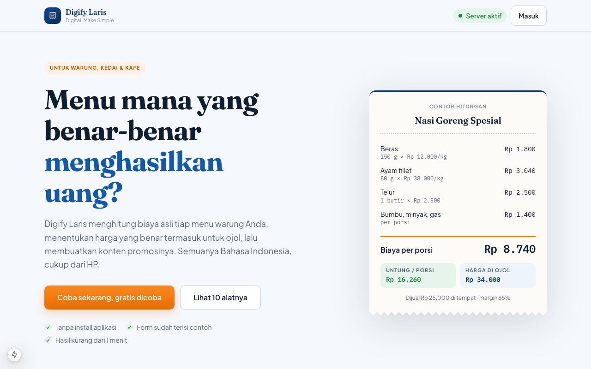
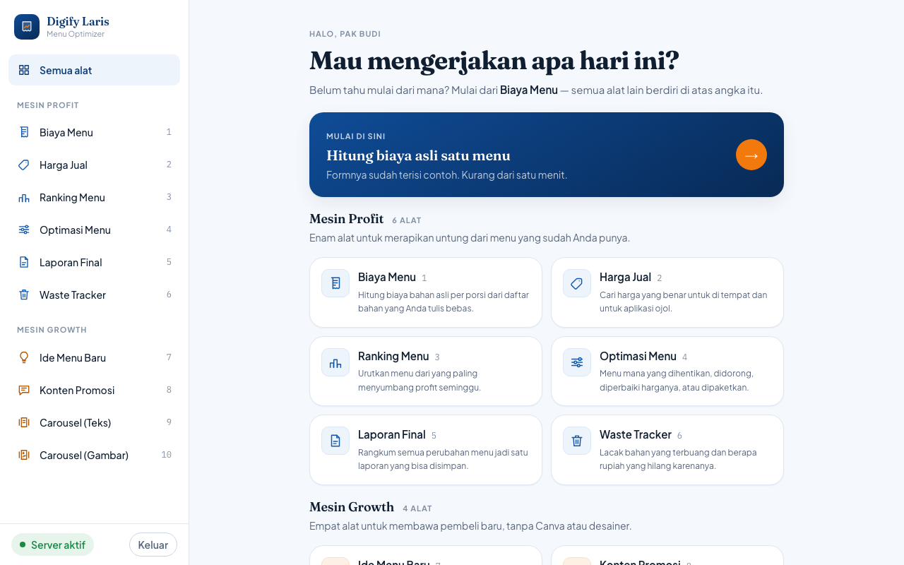
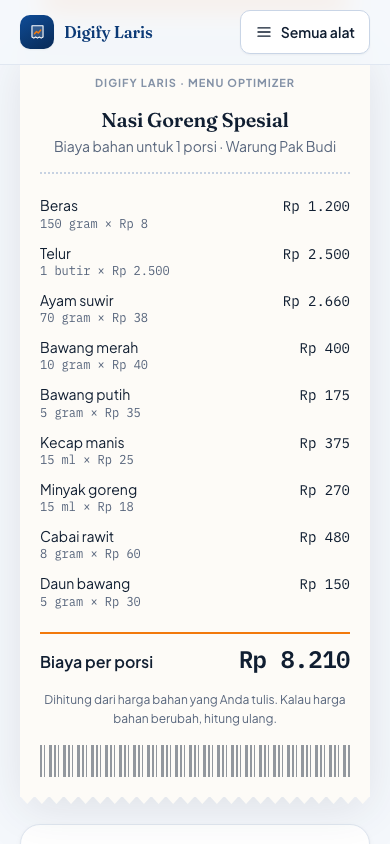

<div align="center">

# Digify Laris — Menu Optimizer

**Menu mana yang benar-benar menghasilkan uang?**

Alat berbasis AI untuk warung, kedai, dan kafe di Indonesia: menghitung profit asli
tiap menu, menentukan harga yang benar termasuk untuk ojol, lalu membuatkan konten
promosinya. Semua Bahasa Indonesia, dipakai dari HP.

[](https://www.djangoproject.com/)
[](https://nextjs.org/)
[](https://react.dev/)
[](https://www.typescriptlang.org/)
[](https://www.postgresql.org/)
[](https://docs.docker.com/compose/)
[](#pwa)

</div>

---

<div align="center">
  
</div>

<table>
<tr>
<td width="62%"></td>
<td width="38%"></td>
</tr>
<tr>
<td align="center"><em>Sidebar tetap di layar lebar</em></td>
<td align="center"><em>Hasil tampil sebagai struk warung</em></td>
</tr>
</table>

---

## Masalahnya

Pemilik warung tahu omzet, tapi tidak tahu profit **per menu**. Harga ditentukan
"kira-kira" atau ikut warung sebelah. Menu paling ramai justru bisa jadi menu paling
merugikan — dan tidak ada yang sadar. Komisi aplikasi ojol yang sekitar 27% memakan
margin diam-diam kalau harga dine-in dipakai apa adanya.

## Sepuluh alat, dua mesin

**Rapikan Untung** — merapikan untung dari menu yang sudah ada.

| # | Alat | Yang dikerjakan |
|:--:|---|---|
| 1 | Biaya Menu | Mengurai daftar bahan yang ditulis bebas jadi biaya asli per porsi |
| 2 | Harga Jual | Harga dine-in dan harga ojol dihitung terpisah, plus harga psikologis |
| 3 | Ranking Menu | Mengurutkan menu dari profit seminggu, bukan dari margin saja |
| 4 | Optimasi Menu | Mana yang dihentikan, didorong, diperbaiki harganya, atau dipaketkan |
| 5 | Laporan Final | Merangkum semua perubahan jadi satu laporan yang bisa disimpan |
| 6 | Bahan Terbuang | Melacak bahan terbuang dan berapa rupiah yang hilang karenanya |

**Tambah Pembeli** — menambah pembeli, tanpa Canva atau desainer.

| # | Alat | Yang dikerjakan |
|:--:|---|---|
| 7 | Ide Menu Baru | Ide menu yang modalnya masih masuk akal untuk warung tersebut |
| 8 | Konten Promosi | Caption, hashtag, dan waktu posting |
| 9 | Naskah Carousel | Alur cerita carousel beserta petunjuk fotonya |
| 10 | Gambar Carousel | Carousel jadi PNG 1080×1350 siap posting, bisa diunduh |

Alat 1–6 dihitung oleh aturan di dalam kode sendiri — cepat, gratis, dan hasilnya
selalu sama untuk input yang sama. Hanya alat 7–10 yang memanggil Gemini.
Alasannya di [`docs/DECISIONS.md`](docs/DECISIONS.md).

## Prinsip yang dipegang

- **Selalu ada isinya.** Setiap form terisi contoh nyata sejak dibuka. Klik hitung →
  lihat hasil → baru ganti dengan data sendiri.
- **Keputusan, bukan angka mentah.** Tiap hasil menyertakan tindakan yang disarankan.
- **Selalu diterjemahkan ke Rupiah.** Persentase tidak pernah berdiri sendiri.
- **Bahasa manusia, bukan bahasa akuntan.** "Biaya Menu", bukan "COGS Analysis".
  "Belum berhasil", bukan "Error 500".
- **Mobile kelas satu.** Dirancang dari 360px, target sentuh ≥ 44px, tidak pernah ada
  scroll horizontal, tabel jadi kartu bertumpuk di layar kecil.
- **Jujur soal tunggu.** Panggilan AI 10–30 detik dan itu disebutkan, lengkap dengan
  kerangka hasil yang menahan tinggi halaman.

## Stack

Django 5 + DRF (Python 3.12) · Next.js 15 (App Router) + React 19 + TypeScript strict ·
PostgreSQL 16 · Redis · Google Gemini (structured output) · Docker Compose

## Menjalankan (development)

```bash
cp .env.example .env          # isi GEMINI_API_KEY
docker compose up --build
```

| Layanan | Alamat |
|---|---|
| Frontend | http://localhost:3000 |
| Backend (health) | http://localhost:8000/api/health |
| Admin Django | http://localhost:8000/admin |

Migrasi jalan otomatis saat container backend start.

```bash
# akun admin
docker compose exec backend python manage.py createsuperuser

# akun tester, tanpa perlu webhook pembayaran
docker compose exec backend python manage.py buat_akun budi@warung.id --nama "Pak Budi"
```

## Perintah harian

```bash
# Backend
docker compose exec backend pytest
docker compose exec backend ruff check . && docker compose exec backend ruff format .
docker compose exec backend python manage.py makemigrations

# Frontend
docker compose exec frontend npm run lint
docker compose exec frontend npm run typecheck
docker compose exec frontend npm run build
```

> [!WARNING]
> Jangan jalankan `npm run build` selama `docker compose up` hidup — build menimpa
> `.next` milik dev server dan halaman jadi 500 sampai container di-restart.

Jangan pernah `pip install` / `npm install` di host. Tambahkan ke
`backend/pyproject.toml` atau `frontend/package.json`, lalu `docker compose up --build`.
Kalau migrasi kusut: `docker compose down -v` lalu `docker compose up --build`.

## PWA

Aplikasi bisa dipasang ke layar utama HP: manifest, ikon, `display: standalone`,
`start_url: /alat`, dan tiga pintasan (Biaya Menu, Ranking, Konten Promosi).

Service worker-nya sengaja pelit — `/api/*` tidak pernah disentuh, halaman tidak
pernah disimpan (isinya bergantung cookie login), dan yang di-cache hanya berkas
statis ber-hash. Di development service worker justru dicopot, supaya perubahan kode
tidak tertahan cache. Rinciannya di [`docs/DECISIONS.md`](docs/DECISIONS.md).

## Desain

Token brand ada di satu tempat, `frontend/src/styles/tokens.css` — komponen tidak
pernah menulis hex mentah. Biru untuk struktur dan trust, oranye **hanya** untuk CTA.
Fraunces untuk judul dan angka besar, Plus Jakarta Sans untuk teks UI, IBM Plex Mono
untuk rupiah. Light mode saja.

Dua elemen tanda tangan yang tidak boleh hilang: **struk** (kertas hangat, garis
putus-putus, total bergaris oranye, tepi sobek) dan **papan ranking** (kartu bernomor
berpita status). Itu yang membuat produk terasa milik dunia warung, bukan dashboard
SaaS generik.

## Produksi

```bash
cp .env.example .env          # isi nilai produksi
docker compose -f docker-compose.prod.yml up -d --build
```

Nginx melayani semuanya di satu domain. Browser tidak pernah menghubungi Django
langsung — Next.js yang meneruskan `/api` sambil memasang token dari cookie httpOnly,
jadi CORS tidak dipakai sama sekali.

Timeout diset 120 detik di Nginx dan Gunicorn. Default-nya (60 dan 30 detik) akan
memutus panggilan AI yang sebenarnya berhasil.

> [!IMPORTANT]
> Sebelum jual publik: uji restore backup sekali, dan kerjakan checklist keamanan di
> [`docs/PRODUKSI.md`](docs/PRODUKSI.md). Model lifetime + API AI berbayar tanpa kuota
> harian adalah tagihan tak terbatas.

## Struktur

```
backend/apps/ai/          panggilan Gemini terpusat (retry + terjemahan error)
backend/apps/optimizer/   endpoint alat — satu modul per fitur
backend/apps/accounts/    User, License, webhook affiliate.id
backend/apps/usage/       UsageLog, DailyQuota, throttle
backend/apps/catalog/     MenuItem tersimpan (dipakai bersama antar alat)

frontend/src/app/         App Router — landing, /masuk, /alat, /offline
frontend/src/components/  ui/ · tools/ · carousel/ · pwa/
frontend/src/styles/      tokens.css — satu-satunya tempat warna brand ditulis
frontend/public/          manifest, service worker, ikon PWA
```

## Dokumen

| Berkas | Isi |
|---|---|
| [`PRD.md`](PRD.md) | Produk, target pengguna, model bisnis, fase pengerjaan |
| [`docs/API_CONTRACT.md`](docs/API_CONTRACT.md) | Kontrak endpoint — mengikat, nama field tidak boleh berubah |
| [`docs/DECISIONS.md`](docs/DECISIONS.md) | Catatan keputusan teknis: apa, kenapa, dan apa yang ditolak |
| [`docs/PRODUKSI.md`](docs/PRODUKSI.md) | Deploy, backup, checklist keamanan |
| [`CLAUDE.md`](CLAUDE.md) | Aturan kerja untuk Claude Code |

---

<div align="center">
<sub>Digify.ID · Digital. Make Simple</sub>
</div>
